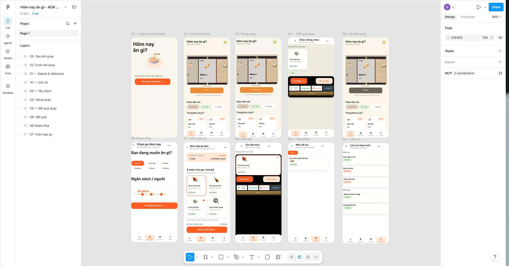

# Ứng Dụng  Hôm nay ăn gì?

Ứng dụng di động giúp người dùng quyết định nhanh bữa ăn: đặt tiêu chí (bữa ăn, ngân sách, nguyên liệu có sẵn), bấm "quay" và nhận món gợi ý, sau đó xem quán hoặc đặt qua Google Maps, GrabFood, ShopeeFood.

## Thành viên nhóm

| STT | Họ và tên | MSSV | Vai trò |
|---|---|---|---|
| 1 | Lương Trọng Nghĩa | [087206014598] | [Nhóm trưởng] |
| 2 | Trần Cao Thịnh | [066206014460] | [Thành viên] |
| 3 | Trần Quốc Kha | [074206003186] | [Thành viên] |

## Liên kết

- Thiết kế Figma: xem [design/figma-link.md](design/figma-link.md)
- Tài liệu đề tài, ý tưởng, nghiên cứu và phân tích: [docs/01-de-tai-y-tuong-phan-tich.md](docs/01-de-tai-y-tuong-phan-tich.md)

## Tính năng chính (MVP)

- Quay chọn món ngẫu nhiên theo tiêu chí
- Xem chi tiết món
- Lưu món yêu thích
- Lịch sử các món đã quay hoặc đã chọn
- Khám phá món theo loại và ngân sách mỗi người

## Danh sách màn hình 

